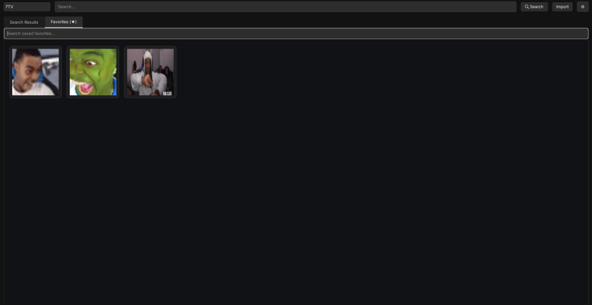
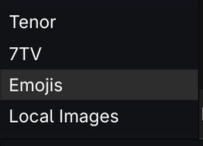

# Bane Emote Board

**Bane Emote Board** is a feature-rich, PyQt6-based desktop application designed for searching, viewing, and managing emotes and GIFs. It integrates with popular platforms like Tenor and 7TV, supports standard Emojis, and allows for local file management.

## Screenshots

<p align="center">
  
  
  
  
</p>

## Features

-   **Multi-Source Search:**
    -   **Tenor:** Search and download GIFs.
    -   **7TV:** Browse and use emotes from the 7TV platform.
    -   **Emoji:** Native support for standard Unicode emojis.
    -   **Local:** Manage your locally saved images and GIFs.
-   **Favorites System:** Star your most-used emotes for quick access.
-   **Local Storage:** Automatically caches downloaded images for faster access.
-   **Theming:** Customizable dark-mode UI with configurable accent colors.
-   **Drag & Drop:** (Planned/Implicit in framework) Easily use emotes in other applications.
-   **Clipboard Support:** One-click copy for links, file paths, or image data.

## Installation

### Prerequisites
-   Python 3.8+
-   `pip` (Python package installer)

### Install Dependencies
Run the following command to install the required Python libraries:

```bash
pip install PyQt6 requests
```

> **Note:** Linux users might need additional system packages for PyQt6 (e.g., `libxcb-cursor0`, `libegl1`).

## Usage

1.  **Clone the Repository:**
    ```bash
    git clone https://github.com/Bane217/bane-emote-board.git
    cd bane-emote-board
    ```

2.  **Run the Application:**
    ```bash
    python bane-emote-board.py
    ```

3.  **Configuration:**
    -   Click the **Gear Icon** (Settings) to configure your Tenor API Key (optional but recommended for higher limits) and customize the UI theme.

## Contributing

Contributions are welcome! Please fork the repository and submit a Pull Request.

## License

[MIT License](LICENSE) (or specify your preferred license)
